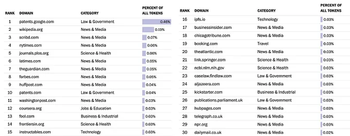

# Data
Data collection is the foundational step in the development of AI Large Language Models. The model's accuracy and effectiveness heavily rely on the quality and origin of this data. Data comes from two primary sources: open-source datasets and independent content websites[^1]. The former, open-source data, such as Wikipedia, consists of large amounts of data usually accessible for commercial use, including the training of LLMs. On the other hand, independent content websites – such as news publications like The Washington Post or The Wall Street Journal, creator-focused platforms like Patreon or Medium, and user-driven platforms like Reddit or Twitter – tend to have stricter policies. These sites are more protective about their content, particularly against unauthorized scraping for commercial applications.

The table below shows the composition of a dataset called C-4, which Google used for its AI model training. However, with the popularity of the AI LLM, there are growing concerns about data, especially in terms of data content and collection methods.

 

## Diversity/Biases of Data
A major concern about the quality of data used in training AI Large Language Models is ensuring that this data is diverse and free of bias. Given that a significant portion of the training data for these models comes from public sources, guaranteeing impartiality is challenging. For instance, Amazon encountered bias with an NLP tool designed to screen job applicants' resumes. The tool was trained on past resumes, using their linguistic patterns to filter current candidates. Historically, resumes from women were underrepresented, the tool unintentionally favored male candidates [^2].

Similarly, a study analyzing 800 billion words from the internet highlighted that certain demographics, especially African Americans, were frequently associated with negative terms. Notably, there were evident biases against senior citizens and individuals with disabilities. Systems like ChatGPT, which derive their knowledge from the vast expanse of the internet, risk mirroring these biases. Such risks are further exacerbated if someone deliberately tries to manipulate the model to disseminate false or biased information. As AI models become more integral to various sectors, addressing these biases is crucial to ensure fair and unbiased decision-making.

## Web Scraping
One of the major concerns with data collection is web scraping. Ideally, LLM developers should maintain transparency by clearly identifying their data sources and ensuring that their scraping practices adhere to the content owners' terms of use. Unfortunately, this has not always been the case, leading to concerns about data privacy and intellectual property rights. OpenAI has been facing criticism for its alleged lack of transparency concerning its data collection methods. The C-4 dataset mentioned above seems to have mostly relied on web scraping, and in some instances, these scraping activities may have contravened the content owners' terms.

An illustrative example of these challenges is Reddit's policy change in April 2023 regarding its API, which had been freely accessible since 2008 [^3]. The decision was prompted by the actions of Pushshift, a data aggregation site commonly utilized by LLM developers. Pushshift's practices had reportedly violated Reddit's API rules, leading to the policy revision. Such incidents underscore the need for clear guidelines when collecting training data from independent content websites.

## Intellectual Property
Intellectual Property protection is another concern with data collection. With tools like ChatGPT that can learn from user inputs, there is a potential threat to proprietary information. If users inadvertently or carelessly input sensitive details, it could jeopardize their company's confidential data or intellectual property. A noteworthy instance is the case of Samsung employees who mistakenly shared proprietary data while using ChatGPT as a work aid, culminating in a substantial data breach[^4].

In 2022, Microsoft, GitHub, and OpenAI faced a proposed class-action lawsuit over "software piracy" in relation to their AI tool, GitHub Copilot. Trained on vast swathes of public code repositories, the tool has come under scrutiny for allegedly replicating extensive segments of copyrighted code without appropriate credit[^5]. 

[1]: https://pub.towardsai.net/data-scraping-in-the-spotlight-are-language-models-overstepping-by-training-on-everyones-content-61138f0199ce
[2]: https://rockcontent.com/blog/chatgpt-bias/#:~:text=Examples%20of%20Bias%20in%20ChatGPT,-The%20natural%20language&text=However%2C%20since%20women%20were%20underrepresented,with%20negative%20words%20than%20others.
[3]: https://en.wikipedia.org/wiki/2023_Reddit_API_controversy
[4]: https://mashable.com/article/samsung-chatgpt-leak-details
[5]: https://www.theverge.com/2022/11/8/23446821/microsoft-openai-github-copilot-class-action-lawsuit-ai-copyright-violation-training-data